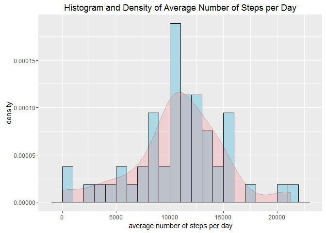
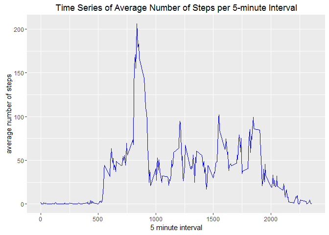
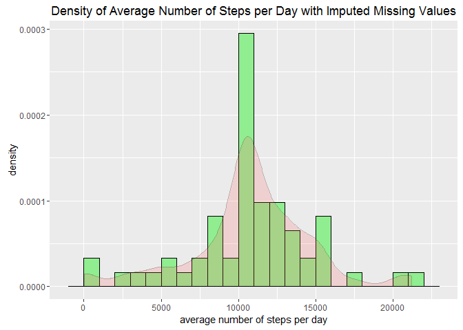
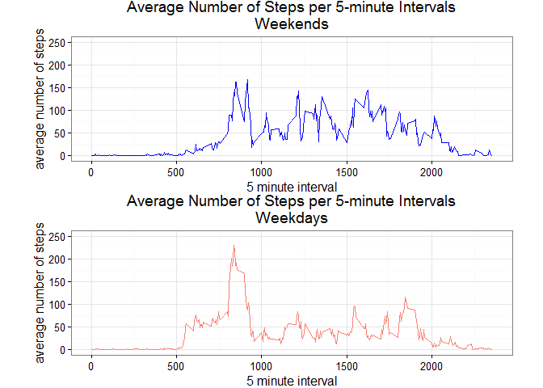

# ACTIVITY MONITORING ANALYSIS
Urli2016  
February 12, 2016  


REPORT
Please note: my histogram with density curve of the average number of steps taken per day is shown below.


```r
setwd("C:/Users/Dumbo Yeti/Desktop/Reproducible Research")
```


```r
options(scipen=999)
activity=read.csv("activity.csv",header=TRUE)
activity$date=as.Date(activity$date)
```


```r
library(plyr)
byDay=ddply(activity,"date",summarize, sum=sum(steps))
```


```r
meanDay=round(mean(byDay$sum,na.rm=TRUE))
medianDay=median(byDay$sum,na.rm=TRUE)
```


```r
library(ggplot2)
ggplot(byDay, aes(x=sum))+
geom_histogram(aes(y=..density..),binwidth=1000,
colour="black", fill="lightblue") +
geom_density(alpha=.2, fill="#FF6666")+
labs(title="Histogram and Density of Average Number of Steps per Day")+
labs(x="average number of steps per day",y="density")
```

```
## Warning: Removed 8 rows containing non-finite values (stat_bin).
```

```
## Warning: Removed 8 rows containing non-finite values (stat_density).
```




MEAN AND MEDIAN

The MEAN number of steps taken per day are 10766.
and the MEDIAN number of steps taken per day are 10765.


AVERAGE DAILY ACTIVITY
This plot shows a time series of the 5-minute interval and the average number of steps taken, across all days.


```r
byInt=ddply(activity,"interval",summarize, avg=mean(steps,na.rm=TRUE))
```


```r
library(ggplot2)
ggplot(byInt, aes(x = interval, y = avg, group = 1))+
geom_line(colour="blue")+
labs(title="Time Series of Average Number of Steps per 5-minute Interval")+
labs(x="5 minute interval",y="average number of steps")
```




```r
which.max(byInt[,2])
```

```
## [1] 104
```


```r
maxInt=round(byInt[104,])
byIntSort=byInt[order(byInt[,2],decreasing=TRUE),]
```


MAXIMUM AVERAGE OF STEPS

The interval which contains the maximum average number of steps taken is interval 835 for a maximum average of 206 number of steps taken per day.


IMPUTING MISSING VALUES


```r
miss=sum(is.na(activity))
n=nrow(activity)
prop=round(sum(is.na(activity))/nrow(activity)*100,1)
```


The total number of missing values in the dataset is 2304 which corresponds to 13.1% of the data. 
To ???ll in the missing data I will replace the missing value with the mean of the corresponding 5-minute interval.

This is done with the packages ???plyr??? and ???Hmisc???


```r
library(Hmisc)
```

```
## Loading required package: lattice
```

```
## Loading required package: survival
```

```
## Loading required package: Formula
```

```
## 
## Attaching package: 'Hmisc'
```

```
## The following objects are masked from 'package:plyr':
## 
##     is.discrete, summarize
```

```
## The following objects are masked from 'package:base':
## 
##     format.pval, round.POSIXt, trunc.POSIXt, units
```


Creating a new dataset, similar to the original dataset, imputing missing values


```r
activity.imputed = ddply(activity, "interval", mutate,
imputed.steps = impute(steps, mean))
act.imp.order=activity.imputed[order(activity.imputed[,2],decreasing=FALSE),]
activity.imp=act.imp.order[,c(4,2,3)]
activity.imp$imputed.steps=as.integer(activity.imp$imputed.steps)
detach("package:Hmisc")
```


As mentioned before, here the HISTOGRAM including densitiy curve of the new dataset with imputed missing values


```r
byDay.imp=ddply(activity.imp,"date",summarize, sum=sum(imputed.steps))
```


```r
library(ggplot2)
ggplot(byDay.imp, aes(x=sum)) +theme_set(theme_bw())+
geom_histogram(aes(y=..density..),binwidth=1000,
colour="black", fill="lightgreen") +
geom_density(alpha=.2, fill="#FF6666")+
labs(title="Density of Average Number of Steps per Day with Imputed Missing Values")+
labs(x="average number of steps per day",y="density")
```




MEAN AND MEDIAN WITH IMPUTED MISSING VALUES


```r
mean.imp=round(mean(byDay.imp$sum,na.rm=TRUE))
median.imp=median(byDay.imp$sum,na.rm=TRUE)
```

The MEAN number of steps taken per day from the dataset with the missing values are 10750.
The MEDIAN number of steps taken per day from the dataset with the missing values are 10641.
These values do di???er from the estimates from the original dataset by 16 and 124 for the means and medians.

The histogram shows that replacing the missing values with the means of the 5-minute-interval have increased the average total number of steps taken per day up to 10000 steps.


FACTOR VARIABLE FOR WEEKEND AND WEEKDAYS


```r
activity.imp$wend = as.factor(ifelse(weekdays(activity.imp$date) %in%
c("Saturday","Sunday"), "Weekend", "Weekday"))
```


```r
activity.WE=subset(activity.imp,wend=="Weekend")
activity.WD=subset(activity.imp,wend=="Weekday")
```


```r
byWE.imp=ddply(activity.WE,"interval",summarize, avg=mean(imputed.steps))
byWD.imp=ddply(activity.WD,"interval",summarize, avg=mean(imputed.steps))
library(gridExtra)
```


WEEKENDS


```r
library(ggplot2)
ggWE=ggplot(byWE.imp, aes(x = interval, y = avg, group = 1))+ylim(0,250)+
geom_line(colour="blue")+
labs(title="Average Number of Steps per 5-minute Intervals\nWeekends")+
labs(x="5 minute interval",y="average number of steps")
ggWE=ggWE+theme(plot.margin=unit(c(0,1,0,1), "cm"))

ggWD=ggplot(byWD.imp, aes(x = interval, y = avg, group = 1))+ylim(0,250)+
geom_line(colour="salmon")+
labs(title="Average Number of Steps per 5-minute Intervals\nWeekdays")+
labs(x="5 minute interval",y="average number of steps")
ggWD=ggWD+theme(plot.margin=unit(c(0,1,0,1), "cm"))

grid.arrange(ggWE, ggWD, nrow=2, ncol=1)
```




The average of number of steps taken per day is higher throughout the day for weekends.
There is a higher spike for the average of number of steps for the weekdays, though.


